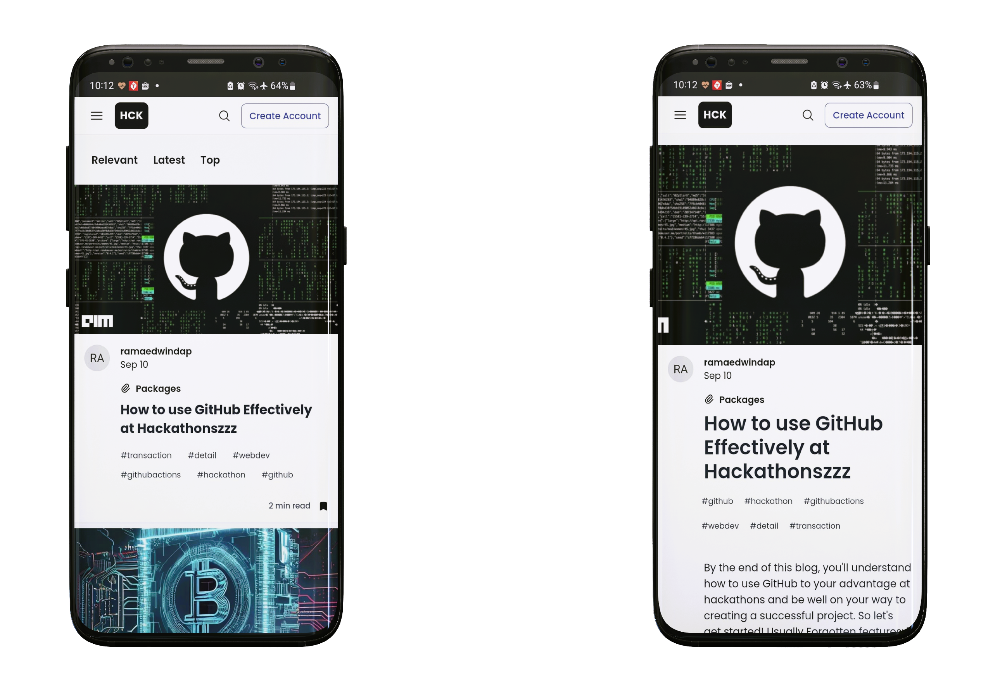

<h1 align="center"> Hck_Community </h1>

<h4 align="center">HCK_Community is a mobile app social network for software developers, inspired by the aesthetic of dev.to. It allows users to view articles on a wide range of topics related to software development, technology, programming, and more.</h4>

  <a href="#techstack">Techstack</a> •
  <a href="#screenshot">Screenshot</a> •
  <a href="#structure">Structure</a> 

## Techstack

This software uses the following open source packages: React.js, React Native, Docker, Expo, Express, Sequelize,
PostgreSQL, GraphQL, MongoDB, Redis, AWS EC2, Apollo-Client.

## Screenshot

 

## Structure

- client-mobile
- server
  - orchestrator (port: 4000)
  - orchestrator-express (port: 4000)
  - services
    - users - mongodb (port: 4001)
    - app - postgres (port: 4002)
